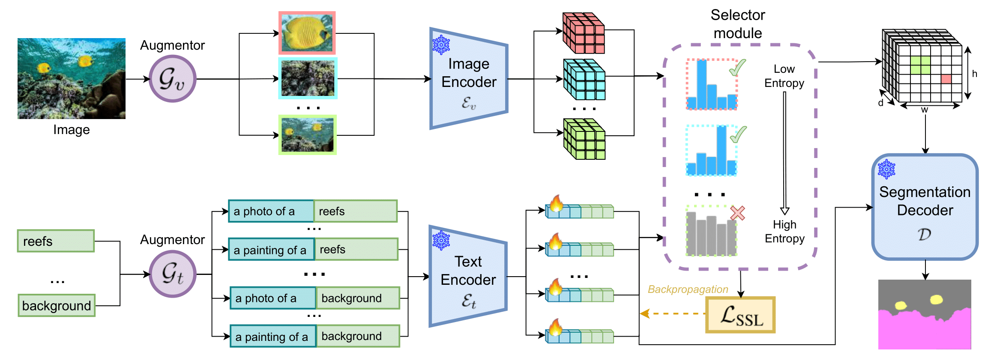
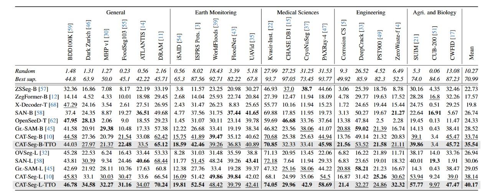
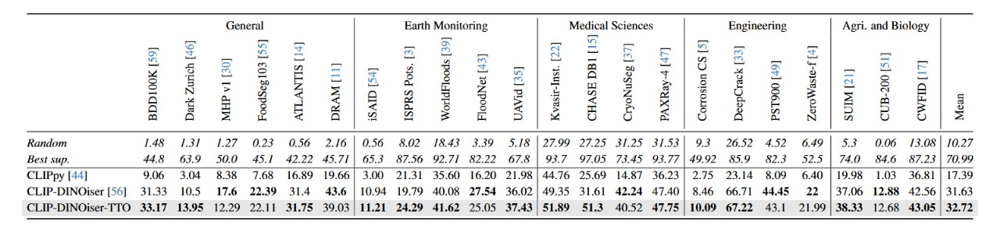

<div align="center">

<h2>Test-Time Optimization for Domain Adaptive Open Vocabulary Segmentation</h2>

[Ulindu De Silva](https://github.com/UlinduP)\*, [Didula Samaraweera](https://github.com/DidulaThavisha)\*, [Sasini Wanigathunga](https://github.com/SasiniWanigathunga)\*, [Kavindu Kariyawasam](https://github.com/KavinduKariyawasam)\*, [Kanchana Ranasinghe](https://kahnchana.github.io), [Muzammal Naseer](https://muzammal-naseer.com), [Ranga Rodrigo](https://ent.uom.lk/team/dr-ranga-rodrigo)

\*Equal Contribution

</div>

## Release Notes

- [2024/01/02] 🔥 **Seg-TTO** is out! We release the [paper](https://arxiv.org/abs/2501.04696) and [code](https://github.com/UlinduP/Seg-TTO/tree/main) for inference and deployment. Seg-TTO achieves **SOTA** results on supervised and unsupervised open-vocabulary semantic segmentation.

## Introduction


We present Seg-TTO, a plug-in-play module focusing on segmentation-specific test time prompt tuning and visual attributes to address the lack of knowledge of vision language models in domain-specific datasets.

For further details and visualization results, please check out our [paper TODO] and our [project page TODO].

## Installation

Please follow [this](cat_seg/INSTALL.md) to setup environment for CAT-Seg version and [this](clip-dinoiser/INSTALL.md) to setup environment for CLIP-DINOiser version of Seg-TTO.

## Data Preparation

Please follow [dataset preparation](datasets/README.md).

## Demo

If you want to try your own images locally, please try [cat seg demo](https://github.com/UlinduP/SegTTO/tree/main/demo) and [clip dinoiser demo](https://github.com/UlinduP/SegTTO/blob/main/clip-dinoiser/demo.ipynb).

## Evaluation

Please follow [this](cat_seg/EVAL.md) to evaluate CAT-Seg version and [this](clip-dinoiser/EVAL.md) to evaluate CLIP-DINOiser version of Seg-TTO.

### Evaluation Results

<div align="center" style="margin-bottom: 20px;">
      
      <br> Figure 2: Zero-Shot Semantic Segmentation on Out-of-Domain Datasets
</div>

<div align="center" style="margin-top: 20px;">
      
      <br> Figure 3: Zero-Shot Unsupervised Semantic Segmentation on Out-of-Domain Datasets
</div>

## Pretrained Models

We provide pre-trained weights for our models reported in the paper. All of the models were evaluated with two 24GB NVIDIA RTX A5000 or 16GB NVIDIA Quadro RTX 5000 and can be reproduced with the evaluation script above. Please note that the results may vary slightly with installed module versions.

<table><tbody>
<!-- START TABLE -->
<!-- TABLE HEADER -->
<th valign="bottom">Name</th>
<th valign="bottom">CLIP</th>
<th valign="bottom">General</th>
<th valign="bottom">Earth Monitoring</th>
<th valign="bottom">Medical Sciences</th>
<th valign="bottom">Engineering</th>
<th valign="bottom">Agri. and Biology</th>
<th valign="bottom">Download</th>

<tr>
<td align="left">CLIP-DINO-TTO</a></td>
<td align="center">ViT-B/16</td>
<td align="center">25.38</td>
<td align="center">27.92</td>
<td align="center">47.87</td>
<td align="center">35.6</td>
<td align="center">31.35</td>
<td align="center"><a href="clip-dinoiser/checkpoints/last.pt">ckpt</a>&nbsp;
</tr>
<!-- TABLE BODY -->
<!-- ROW: CAT-Seg (B) -->
<tr>
<td align="left">CAT-Seg-B-TTO</a></td>
<td align="center">ViT-B/16</td>
<td align="center">35.75</td>
<td align="center">35.61</td>
<td align="center">45.64</td>
<td align="center">29.44</td>
<td align="center">29.66</td>
<td align="center"><a href="https://huggingface.co/hamacojr/CAT-Seg/resolve/main/model_final_base.pth">ckpt</a>&nbsp;
</tr>
<!-- ROW: CAT-Seg (L) -->
<tr>
<td align="left">CAT-Seg-L-TTO</a></td>
<td align="center">ViT-L/14</td>
<td align="center">41.52</td>
<td align="center">40.59</td>
<td align="center">51.4</td>
<td align="center">27.71</td>
<td align="center">38.4</td>
<td align="center"><a href="https://huggingface.co/hamacojr/CAT-Seg/resolve/main/model_final_large.pth">ckpt</a>&nbsp;
</tr>

</tbody></table>

## Acknowledgement

We would like to acknowledge the contributions of public projects [CAT-Seg](https://github.com/cvlab-kaist/CAT-Seg), [MESS](https://github.com/blumenstiel/MESS) and [CLIP-Dinoiser](https://github.com/wysoczanska/clip_dinoiser), whose code has been utilized in this repository.

## Citing Seg-TTO:

```BibTeX
@misc{desilva2025SegTTO,
      title={Test-Time Optimization for Domain Adaptive Open Vocabulary Segmentation}, 
      author={Ulindu De Silva and Didula Samaraweera and Sasini Wanigathunga and Kavindu Kariyawasam and Kanchana Ranasinghe and Muzammal Naseer and Ranga Rodrigo},
      year={2025},
}
```
